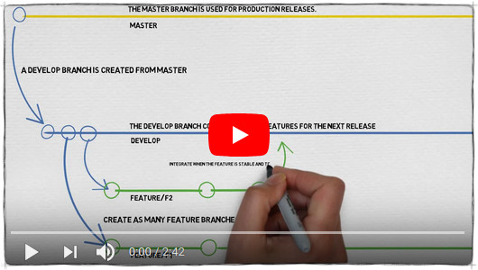

# Contributing to translation-utils

Thank you very much for your contribution! It really is appreciated.
Please have a look at these contribution guidelines before filing your PR.

## Branching Guidelines

This git repo follows a simplified version of **git-flow**:

- The `main` branch always contains stable code.
New features and bug fixes are implemented in `feature/*` branches and are merged to `develop` once they are finished.
- When a new version is about to get released, the content of `develop` will be branched to `release/vX` (where `X` is the new version number)
- Once any pre-release work and testing is done, `release/vX` is merged into `main` and a tag is created to mark the release.
The last step of the release process is to merge `main` back into `develop` in order to get the pre-release work and last-minute bugfixes into the active development branch.
- In rare and critical cases, hotfixes for the latest release can be created in the `master` branch and merged back to `develop`.

In short: File your Pull Requests against `develop` and checkout `main` for the latest "stable" release.

Still unclear? Click the player image above for a good explanation on YouTube!
